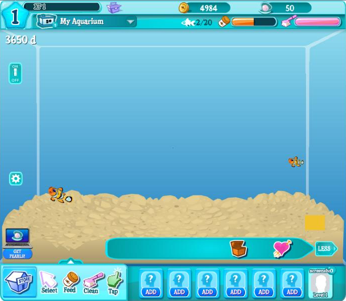

# Happy Aquarium Server

A preservation project for **Happy Aquarium**, the CrowdStar Facebook game (2009) later
operated by 101XP until its shutdown around 2021. This repository contains a small Python
server that emulates the original backend so the surviving game client can boot and be
played again in a browser, through [Ruffle](https://ruffle.rs/).



> **Status: early work in progress.** The client boots into a working tank and the store
> works, but almost all the original art and the server-side catalogue are lost.

## Status

- [x] Original 101XP client boots (preloader, HUD, Harold, settings, day/night light)
- [x] Player saves (coins, pearls, tank contents, client metadata) persisted as JSON
- [x] Store and purchasing (only items whose art survived)
- [x] Fish swim and animate in the tank
- [x] Feeding
- [ ] Buying food, cleaning, coin collection, selling, breeding, fish growth persistence
- [ ] UI text (`lang/en.xml` is lost: some labels show raw `TXT_*` keys)
- [ ] Real tanks, gravels, wallpapers, decorations and most fish (lost, see [wanted list](docs/ASSET_FORMATS.md#wanted))
- [ ] Sound effects and music (lost; served as silence)
- [ ] Neighbors, gifts, expeditions, mini-games

## Requirements

- Python **3.9+**
- A modern browser (Chrome, Firefox, Edge). Ruffle is loaded from unpkg, so the first
  load needs an internet connection (see [Configuration](#configuration) to self-host it).

## Installation

```bash
git clone https://github.com/besuper/HappyAquarium
cd HappyAquarium
```

Create a virtual environment and install the dependencies:

```bash
python -m venv .venv
```

Activate it, on Windows:

```bash
.venv\Scripts\activate
```

or on Linux / macOS:

```bash
source .venv/bin/activate
```

then:

```bash
pip install -r requirements.txt
```

## Usage

```bash
python -m happyaquarium
```

Open <http://localhost:8080/> and wait for the game to load.

| Option | Default | |
|---|---|---|
| `--port` | `8080` | |
| `--host` | `127.0.0.1` | use `0.0.0.0` to play from another device on your network |
| `--debug` | off | Flask debug mode with auto-reload |

Each player gets their own save: `http://localhost:8080/?user=alice` plays as `alice`
(letters, digits, `_` and `-`, up to 32 characters). Without `?user=` you play as `player`.

Saves live in `data/players/<user>.json`. Delete a file to start that player over.

## Configuration

Environment variables:

| Variable | Default | |
|---|---|---|
| `HA_ASSETS_DIR` | `assets/` | folder served as the game CDN |
| `HA_PLAYERS_DIR` | `data/players/` | player saves |
| `HA_DEFAULT_USER` | `player` | player used when the URL has no `?user=` |
| `HA_RUFFLE_URL` | `https://unpkg.com/@ruffle-rs/ruffle` | Ruffle build (point it to a local copy to play offline) |
| `HA_FLASH_LOG` | `1` | relay the client's `trace()` output and ActionScript errors to the server log |

## Project layout

```
happy-aquarium-server/
├── happyaquarium/          Flask application
│   ├── __init__.py         routes: play page, /assets CDN, /comm/<action>.php API
│   ├── __main__.py         command line entry point
│   ├── config.py           settings (environment variables)
│   ├── storage.py          JSON player saves
│   ├── swf.py              on-the-fly fixes to the original client
│   ├── game/
│   │   ├── catalog.py      items, tanks, gravel, store, feature flags
│   │   ├── init_data.py    get_init_data reply
│   │   └── actions.py      other API calls (purchase, set_key...)
│   └── templates/play.html page embedding the client with Ruffle
├── assets/                 the game CDN (original files + generated stubs)
├── tools/make_stub_swf.py  regenerates the placeholder SWFs
├── docs/                   protocol and asset format notes
└── data/players/           player saves (git-ignored)
```

## Contributing

The most valuable contribution is **original game files**. If you played Happy Aquarium,
your browser cache, an old hard drive or a Flash cache folder may still hold some of them.
The [wanted list](docs/ASSET_FORMATS.md#wanted) says what is missing and where the client
looks for it. A captured `get_init_data` response would bring back the real catalogue.

Code contributions are welcome too: the easiest way to find the next missing feature is to
play, watch the server log for `unhandled comm call`, and implement it in
`happyaquarium/game/actions.py`.

## Credits

- **CrowdStar** original developer of Happy Aquarium
- **101XP** operator of the game in its final years (the client build used here)
- **PandaFake** saved the 2021 client files this project is built on
- [**Ruffle**](https://ruffle.rs/) the Flash Player emulator that runs the client
- The [Happy Aquarium Wiki](https://happyaquarium.fandom.com/) community, for documenting the game

## Disclaimer

This is a non-commercial fan preservation project. It is not affiliated with, endorsed by,
or connected to CrowdStar, 101XP or Facebook. Happy Aquarium and all related assets are the
property of their respective owners. The game files are included only to keep this piece of
history playable. If you are a rights holder and want something removed, please open an issue.

## License

The server code in this repository is released under the license in [LICENSE](LICENSE).
The game files in `assets/` are not covered by it (see the disclaimer above).
